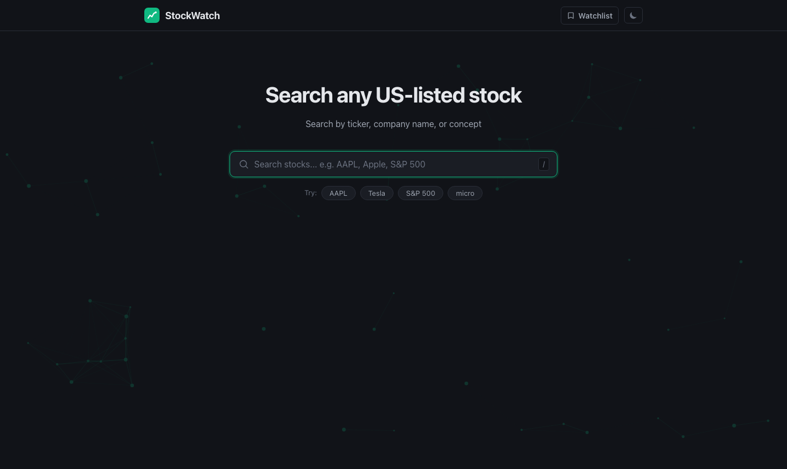
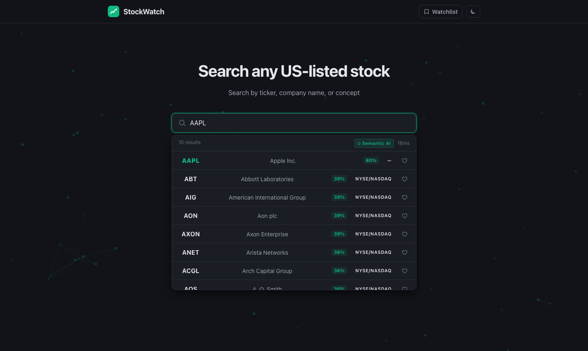
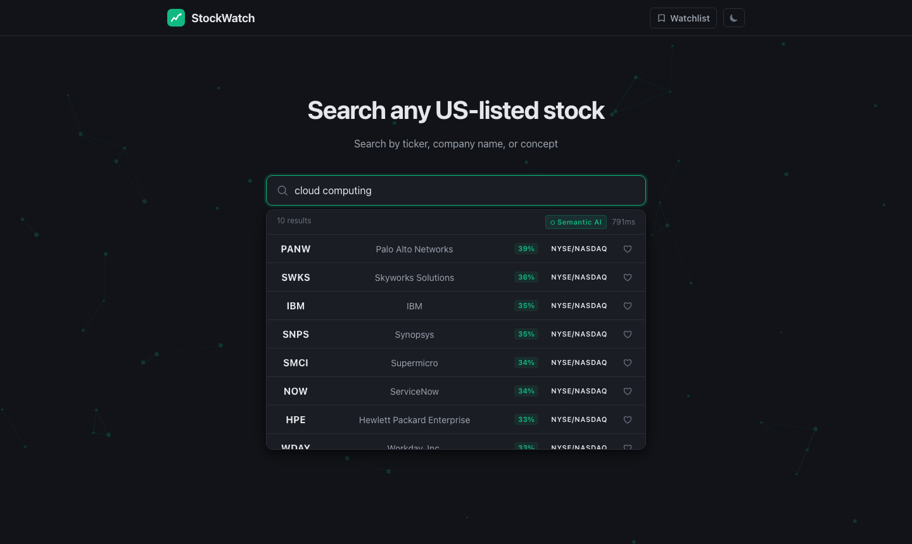
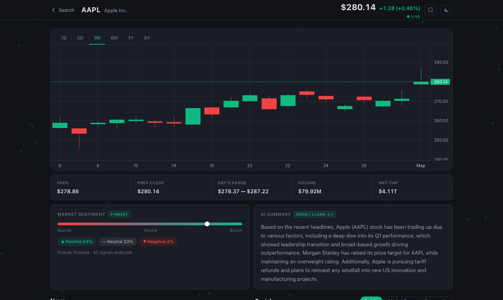
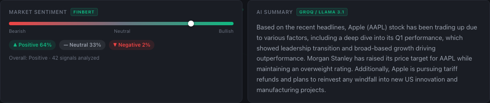
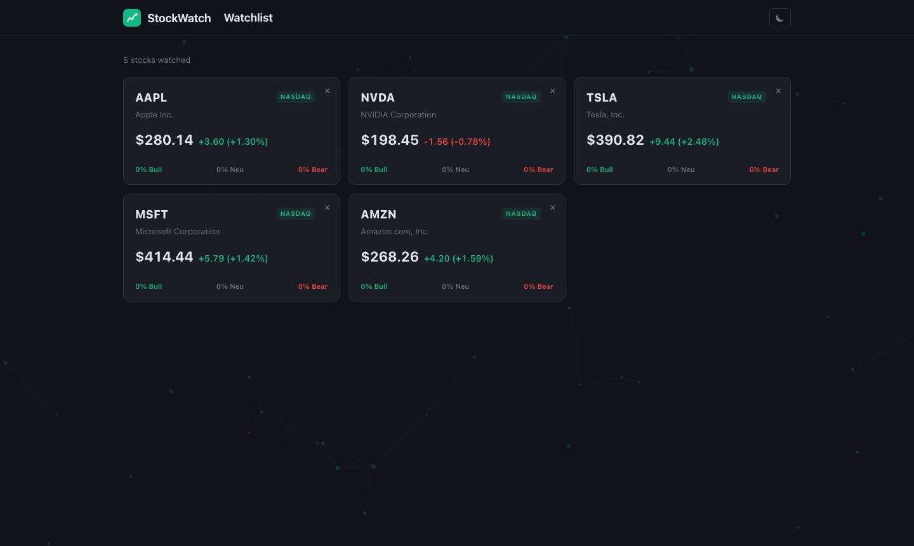
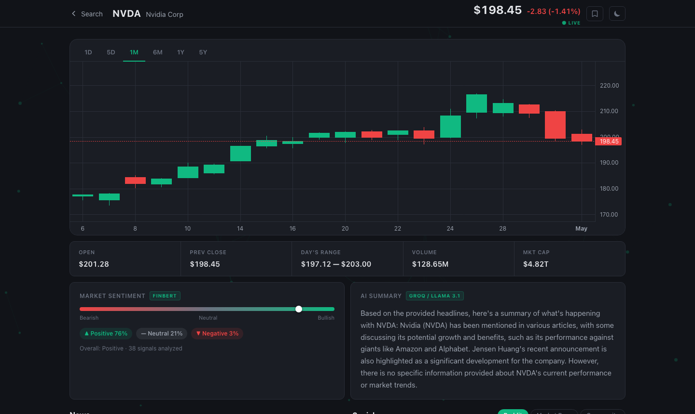
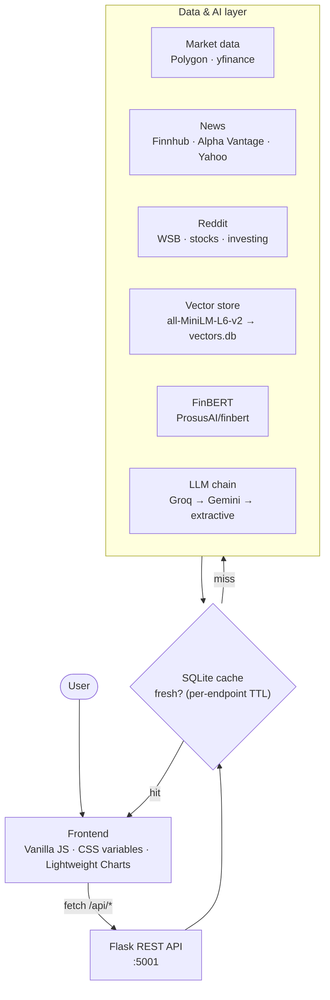

<div align="center">

# 📈 StockWatch

### AI-Powered Stock Intelligence Platform

*Live prices, multi-source news, Reddit chatter, FinBERT sentiment, semantic search,*
*and LLM-generated analyst briefs — for all 503 S&P 500 companies, in one dashboard.*

<br>


<br>



</div>

---

## 🎯 What is StockWatch?

Retail investors are drowning in fragmented information: price data lives in one app, news in another, Reddit sentiment in a browser tab, and none of it is summarized or scored. **StockWatch pulls it all into a single dashboard** and layers AI on top — so instead of *reading* twenty headlines, you *see* how the market feels about a stock at a glance.

Built as a full-stack project for **CSIT 696 – Research Methods** at **Montclair State University** (Spring 2026).

> **TL;DR** — Type a ticker *or* a plain-English idea like *"cloud computing"*, and get a live chart, aggregated news from three providers, top Reddit posts, a FinBERT sentiment breakdown on every headline, and an LLM-written analyst brief — all with graceful fallbacks so nothing breaks when a free-tier API runs dry.

---

## ✨ Engineering Highlights

Three pieces of this project are worth calling out — they're the parts we're proudest of:

### 1. 🔎 Semantic Vector Search over 503 Stocks
Company descriptions (name + GICS sector + sub-industry) are encoded into **384-dimensional, L2-normalized embeddings** with `sentence-transformers` (**all-MiniLM-L6-v2**) and stored as BLOBs in a **SQLite vector store**. At query time we embed the search string and rank *every* stock by cosine similarity — computed as a **single NumPy matrix product** (`matrix @ query`), since normalized vectors make the dot product *equal* cosine similarity. Below a **0.25 relevance threshold** the system automatically falls back to keyword search, so obscure queries still return something useful.

```python
# vectordb.py — the entire ranking step is one matrix multiply
matrix = np.frombuffer(b"".join(embeddings), dtype=np.float32).reshape(n, 384)
scores = matrix @ q_vec              # cosine similarity (vectors are L2-normalized)
top_idx = np.argsort(scores)[::-1][:top_k]
```

### 2. 🧠 FinBERT Sentiment on *Every* Headline & Post
Each news article and Reddit post is scored by **FinBERT** (`ProsusAI/finbert`), a BERT model fine-tuned on financial text. The model is **lazy-loaded in a background thread** on first use and enrichment runs **non-blocking**, so the API responds instantly while sentiment fills in behind the scenes. Individual scores are aggregated into a bullish / neutral / bearish breakdown per stock.

### 3. 🪄 3-Tier LLM Fallback Chain for Analyst Briefs
Summaries are generated by a resilient chain that stays available through any single API outage:

```
Groq (Llama 3.1 8B Instant)  ──►  Gemini (gemini-2.0-flash)  ──►  Extractive summary
        primary                          fallback                    always works
```

Every brief is **grounded in retrieved data** — the prompt is built from real headlines and FinBERT sentiment, not the model's imagination. If both LLM providers fail, a deterministic extractive summarizer composes a readable brief from the top headlines. **The feature never returns an error.**

---

## 🖼️ Screenshots

<table>
  <tr>
    <td width="50%"><b>Smart search — ticker or plain English</b><br></td>
    <td width="50%"><b>Semantic search — "cloud computing"</b><br></td>
  </tr>
  <tr>
    <td width="50%"><b>Stock detail — chart, sentiment, news, brief</b><br></td>
    <td width="50%"><b>FinBERT sentiment + AI analyst brief</b><br></td>
  </tr>
  <tr>
    <td width="50%"><b>Watchlist dashboard — live, auto-refreshing</b><br></td>
    <td width="50%"><b>Works for all 503 S&P 500 stocks</b><br></td>
  </tr>
</table>

---

## 🏗️ Architecture



**Request flow:** the browser calls the Flask API → Flask checks SQLite for a fresh cached response (TTL varies by endpoint: 30 s for live price, 5 min for charts, 1 h for news, 24 h for search) → on a miss it fans out to the relevant providers, runs FinBERT / the LLM chain, caches the result, and returns it. Heavy work (sentiment scoring, vector enrichment) is pushed to **background threads** so responses stay fast.

---

## 🧰 Tech Stack

| Layer | Technologies |
|-------|--------------|
| **Backend** | Python 3.13 · Flask · Flask-CORS |
| **AI / ML** | FinBERT (`transformers` + PyTorch) · `sentence-transformers` (all-MiniLM-L6-v2) · Groq (Llama 3.1 8B) · Google Gemini |
| **Data sources** | Polygon · Finnhub · Alpha Vantage · Yahoo Finance (`yfinance`) · Reddit JSON API |
| **Storage** | SQLite (response cache **and** vector store as `float32` BLOBs) |
| **Search** | NumPy cosine similarity · keyword fallback |
| **Frontend** | Vanilla JavaScript (no framework) · CSS custom properties (dark/light) · [Lightweight Charts](https://github.com/tradingview/lightweight-charts) v4 · `localStorage` |
| **Index seed** | S&P 500 constituents scraped from Wikipedia (`pandas` + `lxml`) |

---

## 🚀 Quick Start

### Prerequisites
- Python 3.11+
- Free-tier API keys (all optional — the app degrades gracefully without them)

### Setup

```bash
# 1. Clone
git clone https://github.com/Ayushs6/StockWatch.git
cd StockWatch

# 2. Create a virtual environment
python3 -m venv venv
source venv/bin/activate        # Windows: venv\Scripts\activate

# 3. Install dependencies
pip install -r requirements.txt

# 4. Add your API keys
cp .env.example .env
# → open .env and paste in your free-tier keys
```

### Run

```bash
# Terminal 1 — backend API (http://localhost:5001)
python backend.py

# Terminal 2 — frontend (http://localhost:8765)
cd frontend
python3 -m http.server 8765
```

Open **http://localhost:8765** and search for a ticker. On first launch the backend builds the semantic index from Wikipedia in a background thread (~503 tickers, a few seconds); FinBERT downloads its weights on first sentiment request.

> 🔑 **Where to get free keys:** [Polygon](https://polygon.io/dashboard/signup) · [Finnhub](https://finnhub.io/register) · [Alpha Vantage](https://www.alphavantage.co/support/#api-key) · [Groq](https://console.groq.com/keys) · [Gemini](https://aistudio.google.com/app/apikey). See [`.env.example`](.env.example) for the full list.

---

## 📡 API Reference

Base URL: `http://localhost:5001`

| Method | Endpoint | Description |
|--------|----------|-------------|
| `GET` | `/api/search?q=<query>` | Semantic + keyword ticker search |
| `GET` | `/api/index/status` | Number of tickers in the vector index |
| `GET` | `/api/stock/<ticker>/live` | Live price + daily change (30 s cache) |
| `GET` | `/api/stock/<ticker>` | Company snapshot (name, market cap, OHLC) |
| `GET` | `/api/stock/<ticker>/chart?period=1M` | Candlestick data (`1D` `5D` `1M` `6M` `1Y` `5Y`) |
| `GET` | `/api/stock/<ticker>/news` | Merged, de-duplicated, FinBERT-scored news |
| `GET` | `/api/stock/<ticker>/social` | Top Reddit posts + buzz breakdown |
| `GET` | `/api/stock/<ticker>/sentiment` | Aggregated sentiment across news + social |
| `GET` | `/api/stock/<ticker>/summary` | LLM analyst brief (Groq → Gemini → extractive) |

<details>
<summary><b>Example — <code>GET /api/stock/AAPL/summary</code></b></summary>

```json
{
  "summary": "AAPL is generating broadly positive coverage across 15 recent articles, with 64% of headlines reflecting bullish sentiment...",
  "model": "Groq / Llama 3.1"
}
```
</details>

---

## 📂 Project Structure

```
StockWatch/
├── backend.py          # Flask API — routes, provider fan-out, LLM chain
├── vectordb.py         # Semantic search: embed, store, cosine-rank
├── sentiment.py        # FinBERT pipeline (lazy-loaded, thread-safe)
├── db.py               # SQLite cache with per-key TTLs
├── requirements.txt
├── .env.example        # Template for API keys
├── frontend/
│   ├── index.html      # Search page
│   ├── stock.html      # Stock detail (chart, news, sentiment, brief)
│   ├── watchlist.html  # Live watchlist dashboard
│   ├── app.js / stock.js / watchlist.js
│   ├── theme.js        # Shared dark/light theme module
│   └── *.css
└── docs/               # Screenshots for this README
```

---

## ⚠️ Limitations & Known Issues

We'd rather be honest than oversell — a few things are constrained by running entirely on **free API tiers**:

- **Alpha Vantage** allows ~25 calls/day; **Gemini** free-tier quota can exhaust mid-session (aggressive caching mitigates both).
- **FinBERT** takes ~8 s to load its weights on the very first sentiment request (fast afterward).
- Social sentiment is **Reddit-only** (public JSON API) — no paid Twitter/X or StockTwits feeds.
- Charts can show gaps on weekends / market holidays.
- The watchlist lives in `localStorage` (no accounts), so it's per-browser.

---

## 🗺️ Roadmap

- [ ] User accounts with server-side, cross-device watchlists
- [ ] Portfolio tracker with cost-basis P&L
- [ ] Price / sentiment alerts via email or push
- [ ] Side-by-side stock comparison view
- [ ] Migrate to async (FastAPI) + WebSockets for true real-time streaming
- [ ] `docker-compose` for one-command setup

---

## 👥 Team

Built for **CSIT 696 – Research Methods**, Montclair State University · Spring 2026

- **Ayush Shrivastava**
- **Vishwa Patel**
- **Ketu Patel**
- **Hetanshi Shah**

---

## 📄 License

Released under the [MIT License](LICENSE).

<div align="center">
<br>
<sub>Built with Flask · FinBERT · all-MiniLM-L6-v2 · Groq · Gemini · Lightweight Charts</sub>
</div>
